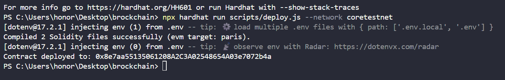
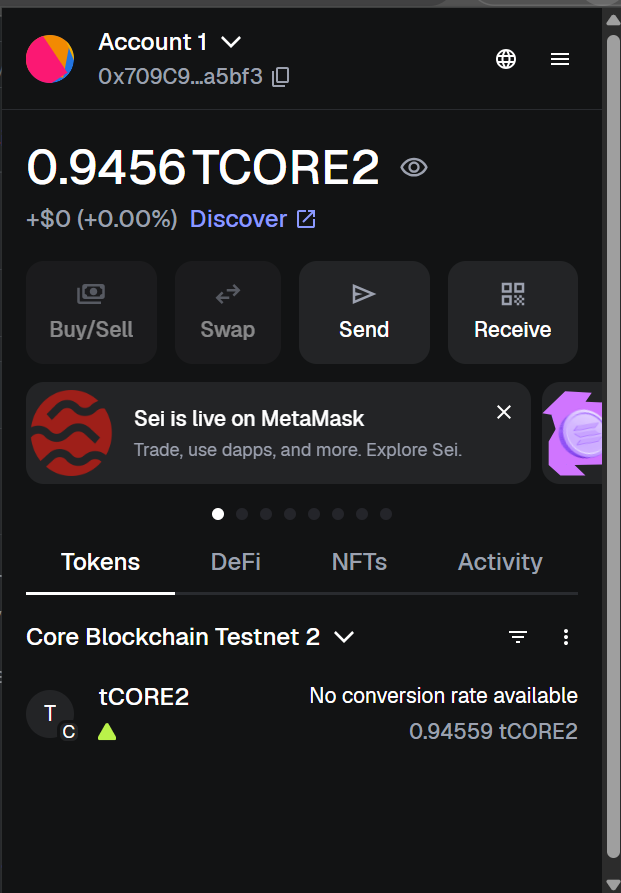

## 📖 Project Overview

**RandaCore** is a Solidity-based smart contract project built using the Hardhat development framework.  
It serves as a foundation for experimenting with decentralized applications (dApps) by providing:

- A core contract (`RandaCore`) that can be extended for various blockchain use cases.
- A sample `Lock` contract to demonstrate Hardhat’s testing environment.
- Scripts for deployment and interaction on both local and public test networks.
- Environment-based configuration for secure and flexible contract management.

This setup is designed for learning, experimenting, and serving as a starting point for larger smart contract systems.

````markdown
# RandaCore – Hardhat Project

This repository contains Solidity smart contracts and a complete Hardhat setup for compiling, testing, deploying, and interacting with them.  
The main contract is **`RandaCore`**, accompanied by a sample **`Lock`** contract and an Ignition deployment module.

---

## 🚀 Prerequisites

Before getting started, make sure you have:

- **Node.js** and **npm** installed
- An **EVM-compatible wallet private key** (with test funds if deploying to a public testnet)

---

## 📦 Installation

Clone the repository and install dependencies:

```bash
npm install
```
````

---

## ⚙️ Environment Setup

Create a `.env` file in the project root and add the following:

```bash
PRIVATE_KEY=your_private_key_here
RANDA_CONTRACT_ADDRESS=deployed_contract_address_here
```

> **Note:** The `coretestnet` network is already configured in `hardhat.config.js`. It automatically loads your `PRIVATE_KEY` from `.env`.

---

## 🛠️ Compile Contracts

```bash
npx hardhat compile
```

---

## 🧪 Run Tests

This project comes with example tests for the `Lock` contract. To run them:

```bash
npx hardhat test
```

---

## 🔗 Run a Local Node (optional)

```bash
npx hardhat node
```

---

## 📤 Deploying Contracts

### Localhost (requires local node running)

```bash
npx hardhat run scripts/deploy.js --network localhost
```

**Example output:**

```text
[dotenv@17.2.1] injecting env (2) from .env
Contract deployed to: 0x8e7aa55135061208A2C3A02548654A03e7072b4a
```

### Core Testnet (requires funded PRIVATE_KEY)

```bash
npx hardhat run scripts/deploy.js --network coretestnet
```

After deployment, copy the printed contract address and update your `.env` file:

```bash
RANDA_CONTRACT_ADDRESS=your_deployed_contract_address
```

---

## 💻 Interacting with `RandaCore`

Once deployed, make sure your `.env` has the correct `RANDA_CONTRACT_ADDRESS`.

### Core Testnet

```bash
npx hardhat run scripts/interact.js --network coretestnet
```

### Localhost

```bash
npx hardhat run scripts/interact.js --network localhost
```

---

## 📸 Screenshots





```

---


```
